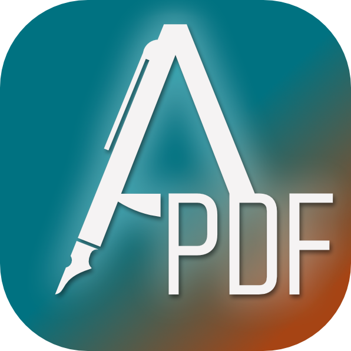
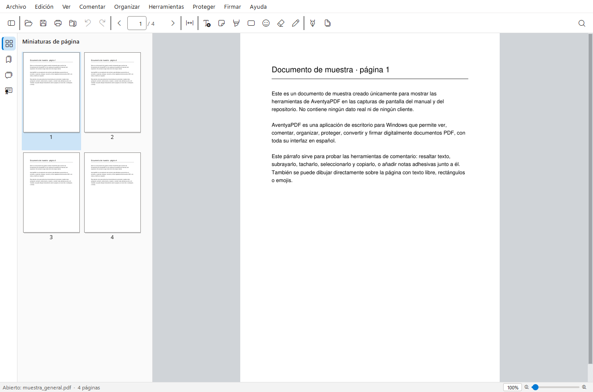
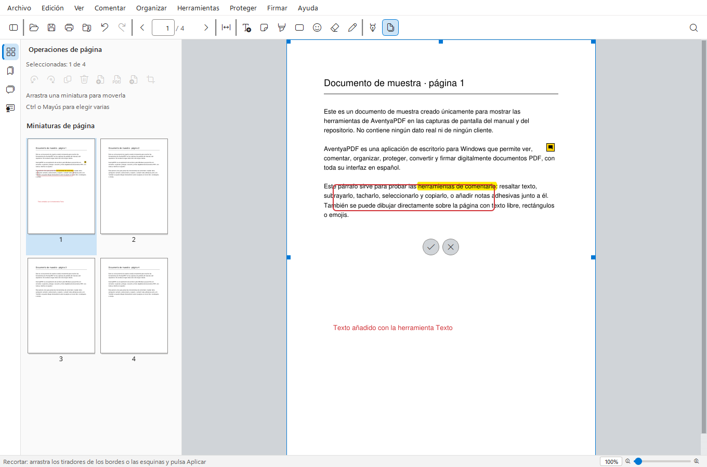
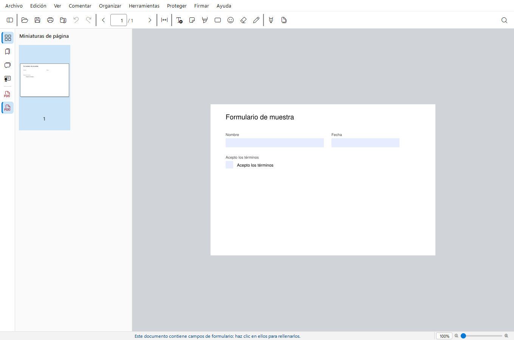
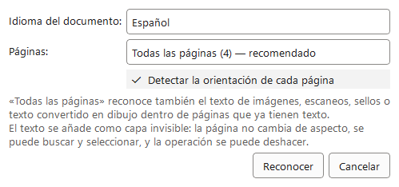

<p align="center"></p>

# AventyaPDF

Aplicación de escritorio para **Windows** para ver, comentar, organizar,
proteger, convertir y firmar digitalmente documentos PDF. Toda la interfaz está
en español.

**Aplicación de libre distribución** · © 2026 Aventya Asesoría Integral SL ·
licencia [GNU AGPL-3.0](LICENSE)

## Capturas

<table>
<tr>
<td width="50%"></td>
<td width="50%"></td>
</tr>
<tr>
<td width="50%"></td>
<td width="50%"></td>
</tr>
</table>

Manual con todas las herramientas, cada una con su captura, en
[docs/MANUAL.pdf](docs/MANUAL.pdf).

## Descargar

El instalador para Windows (64 bits) está en
[Releases](https://github.com/Aventya/AventyaPDF/releases/latest). **Solo se
mantiene la última versión**: las anteriores se desechan y se retiran de GitHub
(qué trajo cada una, en [docs/historial_versiones.md](docs/historial_versiones.md)). Se instala para el
usuario, sin permisos de administrador, y **necesita conexión a Internet**: el
instalador solo lleva el código de AventyaPDF y descarga de sus sitios
oficiales, comprobando cada archivo, Python, los componentes de Python y las
fuentes tipográficas (unos 200 MB). La primera vez que se usa «Reconocer texto
(OCR)» se descarga e instala Tesseract OCR (si no estuviera ya instalado,
pide permiso de administrador una sola vez); el resto de la aplicación
funciona sin conexión.

## Qué hace

- **Ver y navegar**: varios documentos a la vez, miniaturas, marcadores,
  búsqueda, zoom, arrastrar y soltar.
- **Comentar**: texto escrito directamente sobre la página, notas adhesivas,
  resaltar / subrayar / tachar (sobre el texto o a mano alzada), rectángulos,
  emojis y borrador, todo con deshacer.
- **Editar el contenido**: el texto (por párrafos) y las imágenes que ya
  están en el PDF.
- **Formularios**: relleno en el propio campo, con cálculos y validaciones.
- **Organizar páginas**: reordenar, girar, duplicar, insertar, extraer,
  dividir, combinar PDF y crear PDF desde imágenes (también desde el menú
  contextual del Explorador).
- **Firma digital PAdES** con certificados de Windows o archivos `.pfx`,
  sellado de tiempo y certificación; verificación automática de las firmas con
  el almacén de Windows y la lista de confianza de España.
- **Firma manuscrita**: dibujada con el ratón con trazo de estilográfica, o
  cargada desde una imagen.
- **OCR** (Tesseract) con enderezado y corrección de la orientación.
- **Proteger y preparar**: cifrado AES-256 y permisos, marca de agua,
  encabezado y pie, numeración Bates, compresión y exportación a Word,
  imágenes o texto.

## Ejecutar desde el código

Requisitos: Windows 10/11 y Python 3.11–3.13.

```powershell
.\run.ps1            # crea el entorno en %LOCALAPPDATA%\aventyapdf\venv y arranca
.\run.ps1 -Pruebas   # pruebas automáticas (sin abrir ventanas)
```

`run.ps1` instala los paquetes de [requirements.txt](requirements.txt) y
Tesseract OCR si faltan. El instalador se genera con
[empaquetado/construir.ps1](empaquetado/construir.ps1) (lanzador propio +
Inno Setup, que descarga Python y los paquetes al instalar; ver
[docs/empaquetado.md](docs/empaquetado.md)).

## Documentación

- [docs/indice.md](docs/indice.md): documentación por áreas (interfaz, edición,
  firma digital, certificados, herramientas, empaquetado).
- [MEMORIA_EVOLUTIVA.md](MEMORIA_EVOLUTIVA.md): estado del proyecto, decisiones,
  invariantes técnicos e historial de cambios.

## Firma de código

Los instaladores de Windows publicados en
[Releases](https://github.com/Aventya/AventyaPDF/releases) se firman
gratuitamente con [SignPath.io](https://signpath.io), a través de su
programa **SignPath Foundation** para proyectos de código abierto. Detalle
del proceso, roles del equipo y privacidad en
[CODE_SIGNING_POLICY.md](CODE_SIGNING_POLICY.md).

## Licencia

AventyaPDF es software libre: puedes redistribuirlo y modificarlo según los
términos de la **GNU Affero General Public License v3.0** ([LICENSE](LICENSE)).
Si distribuyes una versión modificada, o la ofreces a otros a través de una
red, debes publicar también su código fuente con la misma licencia.

Componentes de terceros, cada uno con su licencia:

| Componente | Licencia |
| :-- | :-- |
| [PyMuPDF](https://github.com/pymupdf/PyMuPDF) / MuPDF | AGPL-3.0 |
| [PyQt6](https://www.riverbankcomputing.com/software/pyqt/) | GPL-3.0 |
| [pyHanko](https://github.com/MatthiasValvekens/pyHanko) | MIT |
| [pdf2docx](https://github.com/ArtifexSoftware/pdf2docx) | MIT |
| [Tesseract OCR](https://github.com/tesseract-ocr/tesseract) | Apache-2.0 |
| [Fluent UI System Icons](https://github.com/microsoft/fluentui-system-icons) | MIT ([vendor/fonts/fluent-icons/LICENSE](vendor/fonts/fluent-icons/LICENSE)) |
| [Noto Sans / Serif / Sans Mono / Emoji](https://fonts.google.com/noto) | SIL OFL 1.1 ([vendor/fonts/noto/OFL.txt](vendor/fonts/noto/OFL.txt)) |
| numpy, OpenCV, cryptography, keyring | BSD / Apache-2.0 / MIT |
