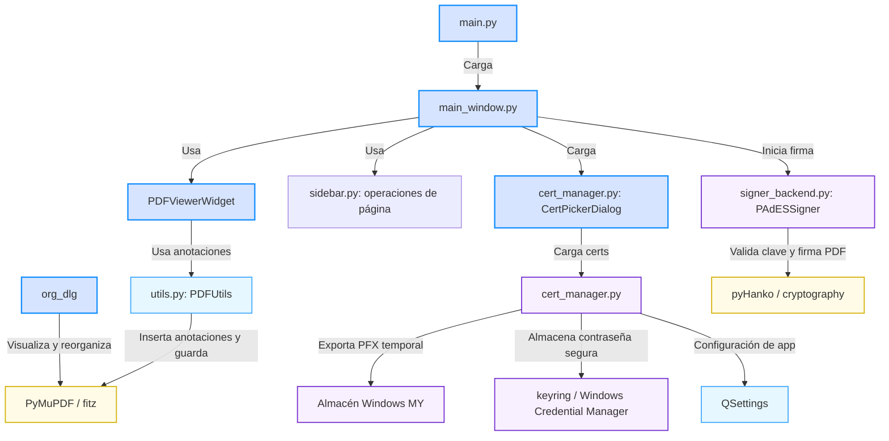

# Arquitectura General del Sistema

Este documento describe la arquitectura de software de **AventyaPDF**, una aplicación de escritorio modular para la visualización, edición y firma digital de archivos PDF basada en la biblioteca gráfica **PyQt6** e integrada con motores avanzados de procesamiento y firma digital.

## Índice del Documento
1. [Visión General de Componentes](#visión-general-de-componentes)
2. [Diagrama de Flujo y Relaciones](#diagrama-de-flujo-y-relaciones)
3. [Capas de la Aplicación](#capas-de-la-aplicación)
4. [Dependencias Tecnológicas Principales](#dependencias-tecnológicas-principales)
5. [Relación con otros Documentos](#relación-con-otros-documentos)

---

## Visión General de Componentes

La aplicación está diseñada con un desacoplamiento claro entre la capa de interfaz de usuario (construida en PyQt6) y la lógica de negocio/criptográfica (construida sobre PyMuPDF y pyHanko).

El sistema se compone de los siguientes módulos fuente:
* [main.py](file:///a:/CARPETA%20IA/RICARDO/AVENTYAPDF/main.py): Arranca la aplicación PyQt6 e inicializa la hoja de estilo global CSS (estilo visual inspirado en Windows 11/Acrobat Premium).
* [main_window.py](file:///a:/CARPETA%20IA/RICARDO/AVENTYAPDF/main_window.py): Gestiona la ventana principal, la barra de herramientas, los paneles de opciones contextuales y el lienzo visor interactivo ([PDFViewerWidget](file:///a:/CARPETA%20IA/RICARDO/AVENTYAPDF/main_window.py#L100)).
* [sidebar.py](../sidebar.py): Panel lateral (miniaturas, marcadores, comentarios, firmas), opciones de herramienta y, desde r27, las operaciones de página (sustituye al antiguo diálogo `organize_dialog.py`).
* [utils.py](file:///a:/CARPETA%20IA/RICARDO/AVENTYAPDF/utils.py): Provee la envoltura para añadir anotaciones vectoriales al PDF usando PyMuPDF.
* [cert_manager.py](file:///a:/CARPETA%20IA/RICARDO/AVENTYAPDF/cert_manager.py): Maneja el almacén de certificados de Windows (MY), archivos PFX/P12, persistencia de credenciales mediante `QSettings` y seguridad de contraseñas mediante `keyring`.
* [signer_backend.py](file:///a:/CARPETA%20IA/RICARDO/AVENTYAPDF/signer_backend.py): Realiza la inyección criptográfica de firmas PAdES incrementales y dibuja el sello gráfico de firma.
* [create_test_cert.py](file:///a:/CARPETA%20IA/RICARDO/AVENTYAPDF/create_test_cert.py): Script auxiliar para generar un certificado RSA autofirmado para pruebas locales.

---

## Diagrama de Flujo y Relaciones

El siguiente diagrama Mermaid ilustra la interacción entre los diferentes módulos y librerías externas del sistema:

---

## Capas de la Aplicación

### 1. Capa de Presentación (UI)
* Gestionada por [main_window.py](file:///a:/CARPETA%20IA/RICARDO/AVENTYAPDF/main_window.py).
* Implementa controles adaptativos para ajustar el nivel de compresión, cambiar colores de anotación de forma dinámica y gestionar la barra secundaria de opciones contextuales (`_opt_row`).
* Usa coordenadas de pantalla en PyQt6 y las traduce a coordenadas normalizadas del documento PDF a través de fórmulas de escala.

### 2. Capa de Procesamiento de Documentos (Document Engine)
* Basada en **PyMuPDF (fitz)**.
* Encargada de renderizar las páginas del PDF a imágenes `QImage`/`QPixmap` de alta definición.
* Ejecuta la manipulación de páginas (eliminar, duplicar, insertar en blanco y fusionar) reconstruyendo la estructura interna del documento sin comprometer su integridad.
* Aplica compresión nativa sobre los flujos de objetos del PDF.

### 3. Capa de Identidad y Criptografía (Crypto & Identity)
* Realiza la lectura, exportación y almacenamiento seguro de identidades digitales para firma electrónica.
* Se integra con el almacén personal de certificados de Windows usando consultas directas .NET (`X509Store`) ejecutadas vía PowerShell asíncrono para sortear limitaciones de exportación.
* Almacena contraseñas cifradas en el almacén de credenciales del sistema operativo mediante `keyring`.
* Utiliza **pyHanko** como motor principal de firma para inyectar firmas PAdES visibles y mantener el estándar de firma incremental del PDF.

---

## Dependencias Tecnológicas Principales

| Biblioteca | Propósito en el Proyecto |
| :--- | :--- |
| **PyQt6** | Construcción de la interfaz de usuario moderna, manejo de diálogos, layouts nativos y pintado superpuesto sobre el visor. |
| **PyMuPDF (`fitz`)** | Renderizado del PDF a imagen, lectura de metadatos, gestión de páginas físicas, e inserción rápida de anotaciones. |
| **pyHanko** | Motor criptográfico de firma digital compatible con PAdES. Maneja el firmado incremental del PDF sin invalidar firmas previas. |
| **cryptography** | Manejo criptográfico subyacente para certificados PKCS#12, claves públicas/privadas y algoritmos de hash. |
| **keyring** | Comunicación con el Administrador de Credenciales de Windows para almacenar y recuperar la contraseña del PFX de forma segura. |
| **pdf2docx** | Exportar a Word (.docx). |
| **Tesseract OCR** | Reconocimiento de texto; no es un paquete de Python (`tesseract_setup.py`). |

**Todos los complementos son obligatorios** (r33) y se instalan a la fuerza si
faltan: Python lo instala `run.ps1` (winget o python.org, para el usuario); los
paquetes de `requirements.txt`, `dependencias.py`, en cada arranque desde
`run.ps1` y también al principio de `main.py`, antes de importar PyQt6; y
Tesseract con sus idiomas, `tesseract_setup.py`.

**Recursos incluidos en `vendor/`** (r36), sin nada que instalar en Windows:
Fluent UI System Icons (iconos, MIT), Noto Sans / Serif / Sans Mono (texto
editable, OFL) y Noto Emoji (emojis, OFL; el índice lo genera `create_emoji_index.py`).
Los **iconos de todos los botones y herramientas** salen de Fluent UI System
Icons: es la única fuente de iconos del programa (`icons.py`). Cada carpeta lleva su licencia.

---

## Relación con otros Documentos

Este fichero se relaciona directamente con:
* **[Índice Principal (indice.md)](indice.md)**: Estructura general de la memoria.
* **[Interfaz Gráfica y Visor (interfaz_grafica.md)](interfaz_grafica.md)**: Detalle del comportamiento de la interfaz y visor.
* **[Edición y Manipulación de PDF (edicion_pdf.md)](edicion_pdf.md)**: Implementación de la edición y organización de páginas.
* **[Gestión de Certificados Digitales (gestion_certificados.md)](gestion_certificados.md)**: Detalle técnico del sistema de identidades y credenciales.
* **[Firma Digital PAdES (firma_digital.md)](firma_digital.md)**: Detalle técnico del backend de firmado.
